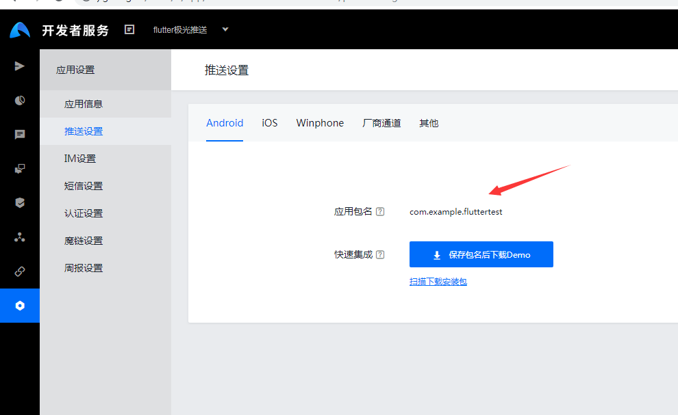
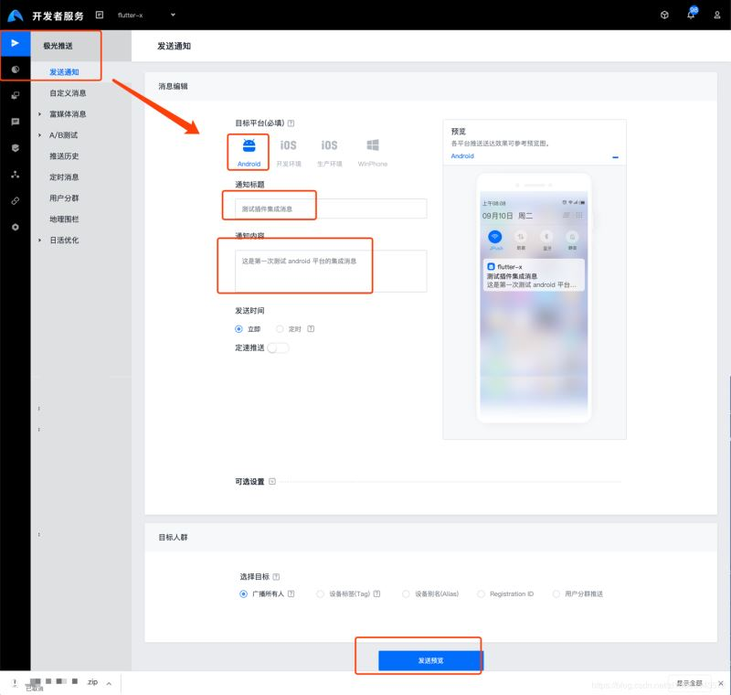

# 集成极光推送

极光注册：https://www.jiguang.cn/

> android 配置 android\app\build.gradle

``` gradle
 defaultConfig {
        // TODO: Specify your own unique Application ID (https://developer.android.com/studio/build/application-id.html).
        applicationId "com.example.flutter_step1"
        ndk {
            //选择要添加的对应 cpu 类型的 .so 库。
            abiFilters 'armeabi', 'armeabi-v7a', 'x86', 'x86_64', 'mips', 'mips64', 'arm64-v8a'
        }
        manifestPlaceholders = [
                JPUSH_PKGNAME : "com.example.fluttertest",
                JPUSH_APPKEY : "你在极光注册平台上应用信息中", // NOTE: JPush 上注册的包名对应的 Appkey.
                JPUSH_CHANNEL : "developer-default", //暂时填写默认值即可.
        ]
        minSdkVersion 21
        targetSdkVersion 28
        versionCode flutterVersionCode.toInteger()
        versionName flutterVersionName
    }
```

> 创建应用配置包名





